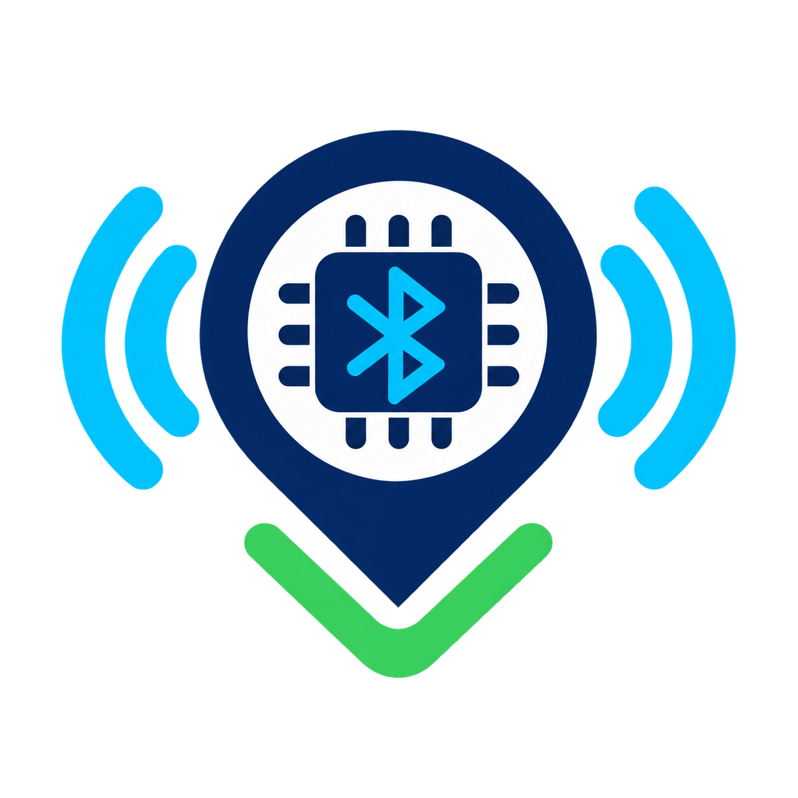
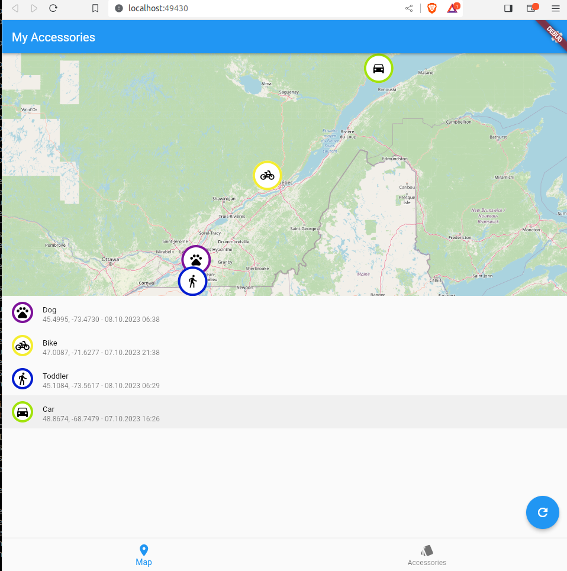

<p align="center">
  
</p>

# ESP32 Find My Beacon — permanent master setup

This is the clean, repeatable master repository for a personal ESP32 beacon
setup using the Apple Find My network, Macless-Haystack, Anisette, an HTTPS
endpoint, and a Flutter web dashboard. It starts from the preserved
Macless-Haystack source (upstream commit `0bda271`) and keeps the local
compatibility fixes in the codebase.

> Use this only for devices you own or have permission to track. Apple may
> change its private services at any time; this project is not affiliated with
> Apple.

## What lives where

```text
ESP32 --BLE--> nearby Apple devices --> Find My network
                                      |
                                      v
                          Azure VM: Anisette + endpoint
                                      |
                                    HTTPS
                                      |
                                      v
                         GitHub Pages Flutter dashboard
```

| Folder | Purpose |
| --- | --- |
| `endpoint/` | Patched Python endpoint and local Docker image definition |
| `macless_haystack/` | Flutter frontend source; endpoint is configured in the app settings |
| `firmware/ESP32/` | ESP32 source and known-good prebuilt firmware |
| `deploy/` | Docker Compose and Caddy templates for the Azure VM |
| `tools/` | Safe helpers to create a device identity, flash a board, and inspect reports |
| `private/` | Created locally only; ignored by Git and holds device keys/tokens |

Read [PATCHES.md](PATCHES.md) before updating anything. The Docker image builds
the source in this repository; it does **not** download and overwrite it from
upstream when it starts.

## Before you begin

You need:

- an ESP32-WROOM/WROVER DevKit V1 (not ESP32-S2), a USB data cable, and a
  computer with Python 3;
- an Apple ID with two-factor authentication enabled;
- an Ubuntu Azure VM or comparable VPS with a public IP and a DNS name;
- a GitHub repository with Pages enabled; and
- a basic understanding that an ESP32 only broadcasts Bluetooth data. It does
  not log in to Azure and it does not contain your Apple account credentials.

Install local tools:

```bash
python3 -m pip install --upgrade cryptography esptool
```

On macOS, the serial port usually looks like `/dev/cu.usbserial-*` or
`/dev/cu.SLAB_USBtoUART`. On Linux it is often `/dev/ttyUSB0`.

## 1. Create your first ESP32 identity

From the repository root, choose a short unique name. The helper writes all
three sensitive files to ignored storage:

```bash
./tools/add_device.sh HOME_TAG
```

It creates:

```text
private/devices/HOME_TAG.keys          private recovery/decryption material
private/devices/HOME_TAG_keyfile       the binary file flashed to the ESP32
private/devices/HOME_TAG_devices.json  the file imported into the dashboard
```

Back up these three files somewhere encrypted and private. Losing them means
you cannot decrypt reports for that beacon; publishing them lets someone else
identify its reports. Do not rename a file after creating it unless you keep
the matching files together.

## 2. Flash the ESP32

Plug in the board and run (replace the port):

```bash
./tools/flash_esp32.sh HOME_TAG /dev/cu.usbserial-0001
```

The command erases the board and writes the known-good files at these offsets:

| Offset | File |
| --- | --- |
| `0x1000` | `bootloader.bin` |
| `0x8000` | `partitions.bin` |
| `0x10000` | `firmware.bin` |
| `0x110000` | `HOME_TAG_keyfile` |

If connection waits at `Connecting...`, hold the board's **BOOT** button until
the connection begins. Press **EN/RESET** once after a successful flash. Leave
the board powered where nearby Apple devices may pass; an initial location
report is not immediate.

## 3. Prepare the Azure Ubuntu VM

SSH to the VM and install Docker, Caddy, and basic tools:

```bash
sudo apt update
sudo apt install -y ca-certificates curl docker.io docker-compose-plugin caddy
sudo systemctl enable --now docker caddy
sudo usermod -aG docker "$USER"
```

Log out and back in after changing Docker group membership. In the Azure portal,
allow inbound TCP **22**, **80**, and **443** in the VM's network security group.
Do **not** open ports 6176 or 6969 to the internet.

Copy this repository to the VM (with Git or a private archive), then enter its
`deploy` folder:

```bash
git clone YOUR_PRIVATE_REPOSITORY_URL esp32-airtag-master
cd esp32-airtag-master/deploy
```

Start Anisette first:

```bash
docker compose up -d anisette
docker compose ps
```

### First Apple login and 2FA

Run the endpoint in the foreground once so you can answer the Apple ID,
password, and SMS 2FA prompts:

```bash
docker compose run --rm --no-deps macless-haystack
```

When it reports that it is serving on port 6176, stop it with `Ctrl+C`. The
generated `auth.json` stays inside the `mh_data` Docker volume. Then start the
normal persistent service:

```bash
docker compose up -d macless-haystack
docker compose logs -f macless-haystack
```

The saved Apple-authentication compatibility patch handles the current Apple
`com.apple.akd/1.0` client signature, absent `M2` responses, and modern trusted
phone/SMS discovery. If Apple rejects an old token, repeat the foreground step
after safely removing only the endpoint's `auth.json` from the `mh_data`
volume; see [PATCHES.md](PATCHES.md).

## 4. Protect the endpoint with Caddy HTTPS

First point a DuckDNS name (for example `mybeacon.duckdns.org`) to your VM's
public IP. In DuckDNS, save the token privately; never put it in this
repository. A regular update command is:

```bash
curl "https://www.duckdns.org/update?domains=YOUR_SUBDOMAIN&token=YOUR_TOKEN&ip="
```

For production, install a systemd timer or the DuckDNS provider's recommended
updater. Verify the DNS record resolves before asking Caddy for a certificate.

Copy the template and replace the hostname:

```bash
sudo cp Caddyfile.example /etc/caddy/Caddyfile
sudoedit /etc/caddy/Caddyfile
sudo caddy validate --config /etc/caddy/Caddyfile
sudo systemctl reload caddy
```

The compose file binds the endpoint only to `127.0.0.1:6176`; Caddy is the
public HTTPS gateway. Before exposing it, set an endpoint username and a long,
unique password in the `mh_data` volume's `config.ini`. The safe pattern is to
open a shell in a one-off service container, copy the example, and edit it on
the server:

```bash
docker compose run --rm --no-deps --entrypoint sh macless-haystack
cp /app/endpoint/data/config.ini.example /app/endpoint/data/config.ini
# edit config.ini with a local editor, set endpoint_user and endpoint_pass, then exit
```

Restart after saving:

```bash
docker compose up -d --force-recreate macless-haystack
```

Test from your computer with `https://YOUR_DUCKDNS_NAME`. A browser may show a
plain “Nothing to see here” response; that proves the endpoint is alive. Do not
place endpoint passwords in GitHub Pages, source code, command history, or a
public URL.

## 5. Deploy the Flutter dashboard to GitHub Pages

Push this repository to a **private** GitHub repository after reviewing the
secret check below. In GitHub, open **Settings → Pages** and select **GitHub
Actions** as the source. The included Pages workflow builds
`macless_haystack/` from source and deploys it automatically after a push to
`main`.

For a project Pages site, it automatically uses `/<repository-name>/` as the
Flutter base path. For a custom domain/root site, change the workflow build
argument to `--base-href "/"` before deploying.

Open the deployed site, then in **Preferences** set:

- endpoint URL: `https://YOUR_DUCKDNS_NAME`
- endpoint username and password: the values stored in the VM's `config.ini`

The web application stores imported device identities in that browser's local
storage. Use a password manager and export/accessory backup feature where
available before clearing browser data.

## 6. Import the first device

In the Pages frontend:

1. Open **Accessories** and choose **Add / Import**.
2. Select `private/devices/HOME_TAG_devices.json`.
3. Save the accessory and refresh its reports.

The frontend decrypts the reports locally. Reports may take time to appear,
and only exist when an Apple device has observed the beacon.

## Adding ESP32 #2, #3, and later — no backend or frontend rebuild

The backend is a shared report proxy; it does not contain a device list. Each
ESP32 only needs a unique identity and its JSON imported into the already
deployed dashboard. For every new board:

```bash
./tools/add_device.sh CAR_TAG
./tools/flash_esp32.sh CAR_TAG /dev/cu.usbserial-0002
```

Then, on the existing GitHub Pages dashboard, import
`private/devices/CAR_TAG_devices.json` as another accessory. That is all:

- no Docker rebuild;
- no new Apple login;
- no Caddy/DuckDNS change; and
- no frontend compilation or GitHub Pages deployment.

Keep each device's three generated files together in private encrypted backup.
Do not flash the same keyfile to two boards unless you intentionally want them
to be indistinguishable.

## Useful diagnosis

```bash
# VM service health
cd deploy && docker compose ps
docker compose logs --tail=100 anisette
docker compose logs --tail=100 macless-haystack

# Optional local report/decryption diagnosis. Device keys stay under private/.
MH_AUTH_FILE=private/auth.json python3 tools/request_reports.py --keys-dir private/devices
```

Common causes of an empty map are no nearby Apple devices, a recently flashed
beacon, an incorrect imported JSON file, an endpoint URL missing HTTPS, an
expired Apple token, or CORS/proxy misconfiguration. Verify containers first,
then Caddy/DNS, then the dashboard endpoint settings.

## Backups, updates, and security

- Back up the `mh_data` and `anisette-v3_data` Docker volumes privately. They
  contain Apple session/token material. Back up every `private/devices/` file.
- This repository ignores tokens, keys, device JSON, PEM files, SQLite report
  databases, build output, and local configuration. Do not override that.
- Keep `config.ini` and `auth.json` on the VM volume, not in this repository.
- The frontend is public static code; never build Apple credentials into it.
- Review `git status --ignored` and the secret scan before every push.
- Do not run the old upstream `endpoint/updateRepo` script: the master
  Dockerfile intentionally avoids it so compatibility fixes are retained.

See [docs/OPERATIONS.md](docs/OPERATIONS.md) for restore and troubleshooting
steps, and [PATCHES.md](PATCHES.md) for the permanent patch record.

## Dashboard preview


